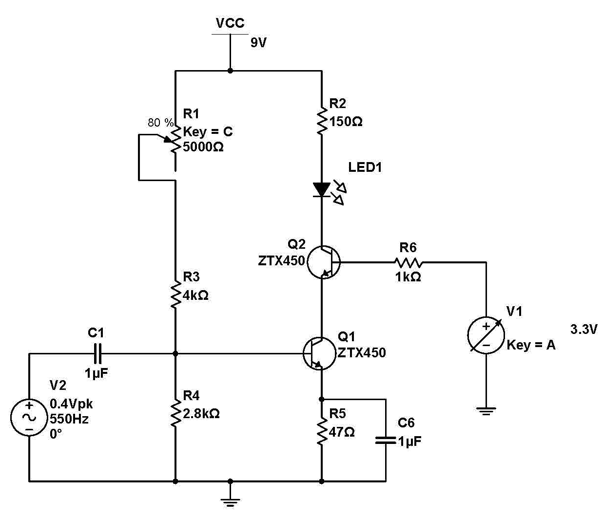
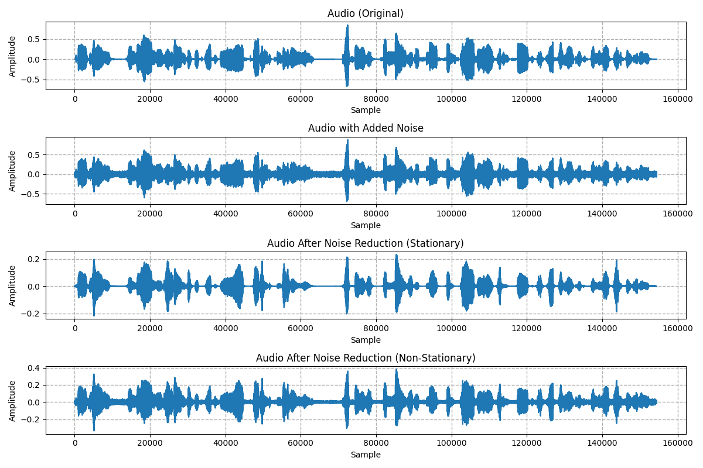
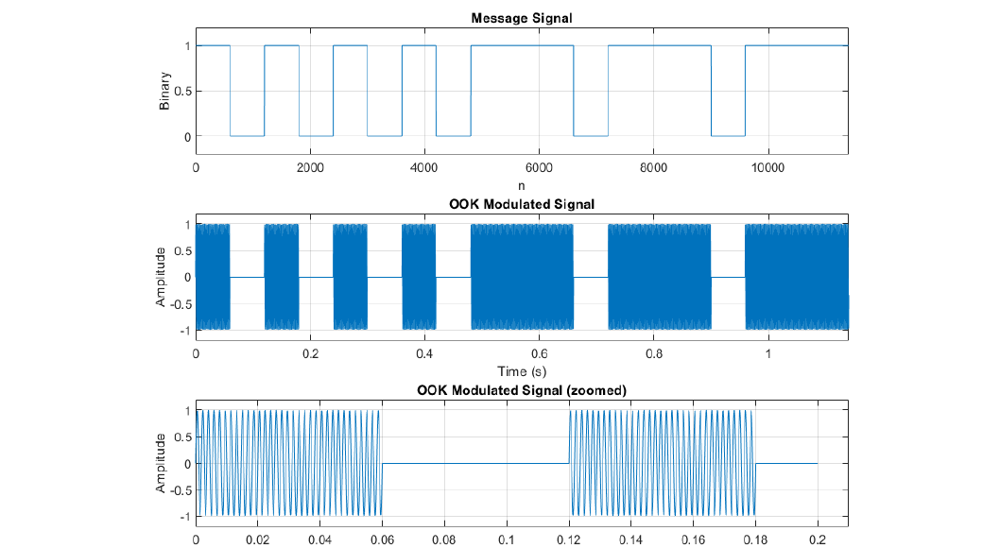
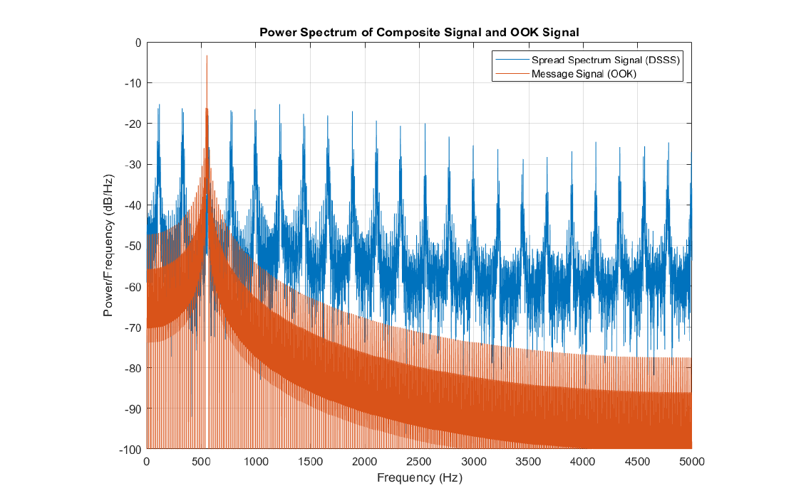

# Voice-to-Morse Laser Transmitter

My part of our 4th-year group project at UCL (Electronic & Electrical Engineering, 2024): *Anti-EMP, Espionage and Jammer Laser Morse Code Decoder for Encrypted Communications*.

The team was Hirad Yazdani, Terence Placidus and me, supervised by Dr Chin-Pang Liu. The overall idea was to replace radio with a free-space laser link for military communications, because a laser link is much harder to jam or intercept.

My part was the **voice-based transmitter**. You speak into a microphone on a Raspberry Pi, it converts your speech to text, turns the text into Morse code and flashes it out on a laser. I also simulated adding **direct sequence spread spectrum (DSSS)** to the laser signal in MATLAB.

## How it works

1. **Mic → voice activity detection** (webrtcvad) cuts the audio into utterances.
2. **Noise reduction** (noisereduce, spectral gating) cleans each utterance.
3. **Speech to text** with Mozilla DeepSpeech 0.9.3 (pre-trained English model, runs offline on the Pi).
4. **Text → Morse** with a lookup table.
5. **Morse → GPIO pin → laser.** Each dot/dash is sent as a short spreading code (`1010`), not a plain on/off pulse.

The laser driver uses two ZTX450 transistors:

- Q2 switches the laser diode on and off from the Pi's GPIO pin (OOK).
- Q1 adds a 550 Hz tone on top. The receiver (Hirad's) detects that tone, so ambient light doesn't trigger it.

<p align="center"></p>

## Results

I tested speech recognition on 40 clips from the LJ Speech dataset with Gaussian noise added, with and without noise reduction:

| | Word error rate | Accuracy |
|---|---|---|
| Without noise reduction | 28.2% | 71.8% |
| With noise reduction | 22.9% | **77.1%** |

Those are the numbers in the report.

Looking back, I computed WER on the raw text, so capital letters and punctuation counted as mistakes ("Gothic" vs "gothic"). After lowercasing and removing punctuation it's **78.4% → 83.2%**. That's the same improvement, but a fairer absolute number. Both are printed by `evaluation/wer.py`.

<p align="center"></p>

Stationary noise reduction (third panel) works best on this test because the added noise is constant. Real background noise changes over time, so the transmitter uses the non-stationary version (bottom panel).

### DSSS simulation (MATLAB)

The Morse message is OOK-modulated onto the 550 Hz tone. It's then multiplied by a ±1 pseudo-noise code from a 4-bit LFSR, which spreads its energy over a much wider band. A narrowband jammer then only hits a small part of the signal, and without the code you can't despread it.

<p align="center">
  
  
</p>

## Files

```
pi_transmitter.py            the Raspberry Pi version: mic -> DeepSpeech -> Morse -> laser (GPIO)
laptop_test.py               same pipeline without GPIO, used for the accuracy tests
evaluation/
  resample_ljspeech.py       1. resample LJ Speech to 16 kHz
  add_noise.py               2. add Gaussian noise to every clip
  plot_noise_reduction.py    3. the noise reduction figure above
  wer.py                     4. word error rate of the transcripts
matlab/
  dsss_ook_simulation.m      OOK and DSSS simulation + spectra
original/                    my original 2024 files, unchanged
```

## Running it

DeepSpeech is no longer maintained, and its last release (0.9.3) only installs on **Python 3.9 or older**.

```bash
pip install -r requirements.txt
```

Download the model files from the [DeepSpeech 0.9.3 release](https://github.com/mozilla/DeepSpeech/releases/tag/v0.9.3):

- `deepspeech-0.9.3-models.pbmm` (on a PC) or `.tflite` (on the Raspberry Pi)
- `deepspeech-0.9.3-models.scorer`

These files are too big for GitHub, so they aren't in this repo.

```bash
# on the Pi, with the laser driver on GPIO 22
python pi_transmitter.py -m deepspeech-0.9.3-models.tflite -s deepspeech-0.9.3-models.scorer -r 48000

# on a laptop, from a .wav file (or leave out -f to use the mic)
python laptop_test.py -m deepspeech-0.9.3-models.pbmm -s deepspeech-0.9.3-models.scorer -f clip.wav
```

`-r 48000` is there because my USB mic records at 48 kHz. The audio gets resampled to 16 kHz.

To redo the accuracy test:

1. Download [LJ Speech 1.1](https://keithito.com/LJ-Speech-Dataset/) into `data/`.
2. Run the scripts in `evaluation/` in order.
3. Run each noisy clip through `laptop_test.py` with `NOISE_REDUCE = True` and then `False`.

## Changes since the report

The original files are in `original/`. In the cleaned-up versions I:

- **Fixed a pin bug in the Pi script.** In the code I pasted into the report, dots were sent on GPIO 17 while only pin 22 was set up as the laser output. I used the correct pin during testing. The cleaned-up script uses pin 22 for everything.
- **Moved `GPIO.cleanup()` to the end.** It used to run after the first message, so a second message would fail. This didn't matter when testing one message at a time.
- **Made `translate()` skip characters** that have no Morse code instead of crashing. I also fixed the apostrophe, which was mapped to `.`.
- **Turned the with/without noise reduction switch into a `NOISE_REDUCE` setting**, instead of editing the code by hand each time.
- **Replaced hard-coded `C:\Users\...` paths** with relative ones, and removed debug prints and commented-out code.

## Limitations


- Only 40 clips from one speaker, with artificial white noise. The noise is random with no fixed seed, so re-running gives slightly different numbers. Basically needs more testing. 
- The noise reduction settings needs to be tuned using PESQ or SNR.
- In the Pi version, the noise sample given to noisereduce is the start of the utterance, which already contains speech, so it isn't a clean noise profile.
- The first word of each clip was often dropped. I think the VAD starts recording slightly too late.
- In the MATLAB simulation, the gap between letters is 1 unit instead of the standard 3.
- DeepSpeech is discontinued. Today I'd use something like Whisper or Vosk.

## Credits

- [Mozilla DeepSpeech](https://github.com/mozilla/DeepSpeech). `pi_transmitter.py` and `laptop_test.py` are based on Mozilla's `mic_vad_streaming.py` example (Mozilla Public License 2.0). The `Audio` class and argument parsing are mostly theirs.
- [noisereduce](https://github.com/timsainb/noisereduce) by Tim Sainburg for the spectral gating.
- [LJ Speech dataset](https://keithito.com/LJ-Speech-Dataset/) (Keith Ito).
- The LFSR/spreading part of the MATLAB script started from an online DSSS-BPSK MATLAB example.
- Hirad Yazdani (laser receivers) and Terence Placidus (Arduino decoder, satellite switching) for the rest of the system.

## Licence

- `pi_transmitter.py` and `laptop_test.py` are under the Mozilla Public License 2.0, because they're modified from Mozilla's example.
- Everything else is MIT.

See [LICENSE](LICENSE).

Muhammad Alief bin Azman
